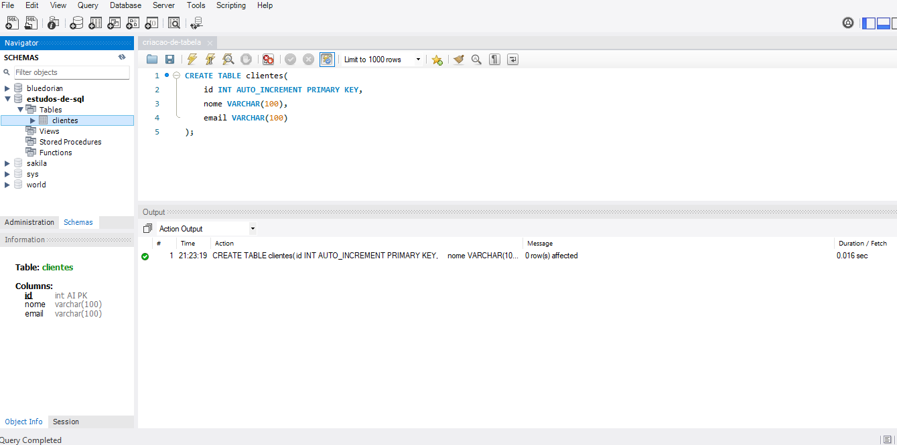

# Introdução ao SQL e MySQL

SQL (Structured Query Language) é a linguagem padrão para manipulação de bancos de dados relacionais. MySQL é um dos sistemas de gerenciamento de bancos de dados (SGBD) mais populares, usado para armazenar, manipular e recuperar dados.

## Principais comandos do SQL

- `SELECT`: Busca dados em tabelas.
- `INSERT`: Insere novos dados.
- `UPDATE`: Atualiza dados existentes.
- `DELETE`: Remove dados.
- `CREATE`: Cria tabelas ou bancos de dados.
- `DROP`: Exclui tabelas ou bancos de dados.

## Exemplo de Criação de Tabela.

```sql
CREATE TABLE clientes (
  id INT AUTO_INCREMENT PRIMARY KEY,
  nome VARCHAR(100),
  email VARCHAR(100)
);
```

Nesse trecho, criei uma tabela com o nome `clientes`, na qual há 3 colunas. A **1ª Coluna** tem o nome `id` e é do tipo **INT**, que sempre que uma linha é acrescida já é auto-incrementada(Começa no 1, assim, quando a próxima linha for gerada ela automaticamente receberá o id 2, e assim por diante) através do atributo **AUTO_INCREMENT**, além de ser declarada como a chave primária da tabela pelo atributo **PRIMARY KEY**. A **2ª Coluna** tem o nome `nome` e é um **VARCHAR**, que pode guardar até 100 caracteres. O mesmo se repete para a **3ª Coluna**, porém ela possui o nome `email`.

## Notas Importantes!

No SQL, não importa a forma de escrita entre **Uppercase** e **Lowercase** (Ex.: `AUTO_INCREMENT` / `auto_increment`. Ambos funcionarão), porém, o ideal é que mantenhamos sempre um padrão na forma de escrita, para facilitar a visualização de todo o projeto. No meu caso, estarei tilizando a convenção de escrever os comando em **UPPERCASE**.

O tipo `VARCHAR` se difere do `CHAR` pois ao utilizar (por exemplo) **VARCHAR(30)** ele ocupará até 30 caracteres, sendo que caso o dado não ocupe esse caracteres, eles não ocuparão espaço na memória. No caso do tipo **CHAR** eles usaria os caracteres informados e preencheria os espaços não utilizados por "espaços em brancho".

No arquivo `Detalhes.md` há uma descrição mais detalhada da parte teórica do conteúdo. Dê uma olhadinha para apronfudar mais sobre o conteúdo! 🖖📚



## Referências

[Curso em Vídeo - Curso MySQL #03 - Criando o primeiro Banco de Dados](https://youtu.be/m9YPlX0fcJk?list=PLHz_AreHm4dkBs-795Dsgvau_ekxg8g1r)

---
