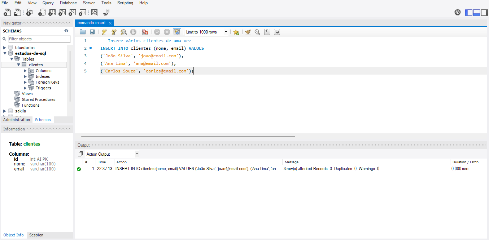
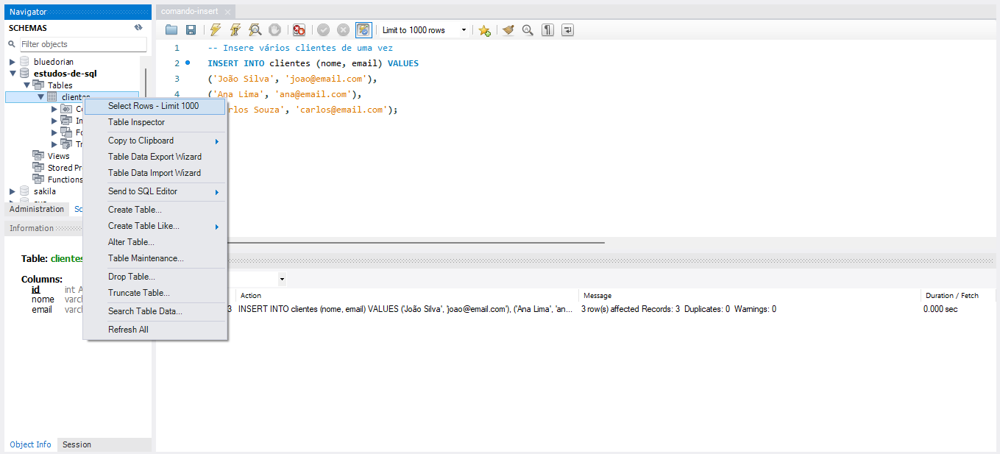
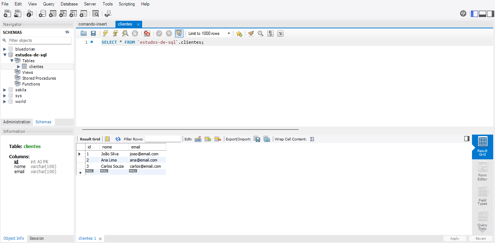

# Comando INSERT

O comando INSERT é utilizado para inserir novos registros em uma tabela do banco de dados. É necessário informar o nome da tabela e os valores para cada coluna.

## Exemplo

```sql
INSERT INTO clientes (nome, email) VALUES ('João Silva', 'joao@email.com');
```

Você também pode inserir vários registros de uma vez:

```sql
INSERT INTO clientes (nome, email) VALUES 
('Ana Lima', 'ana@email.com'),
('Carlos Souza', 'carlos@email.com');
```


### Inserindo Linhas


### Selecionando Linhas para Visualização


### Visualizando Linhas

---

## Referências

[Curso em Vídeo - Curso MySQL #05 - Inserindo Dados na Tabela (INSERT INTO)](https://youtu.be/NCG9niOlm40?list=PLHz_AreHm4dkBs-795Dsgvau_ekxg8g1r)

---