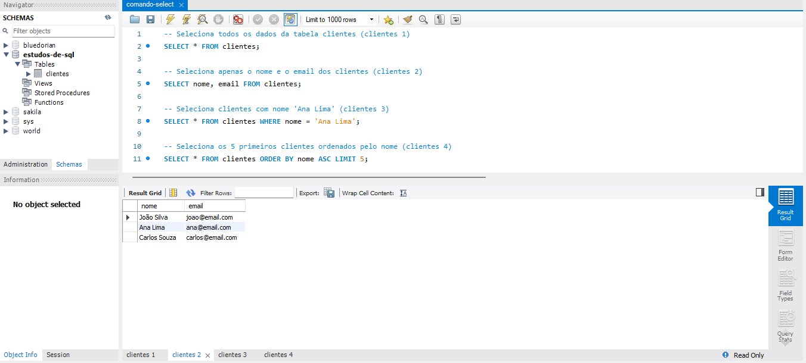
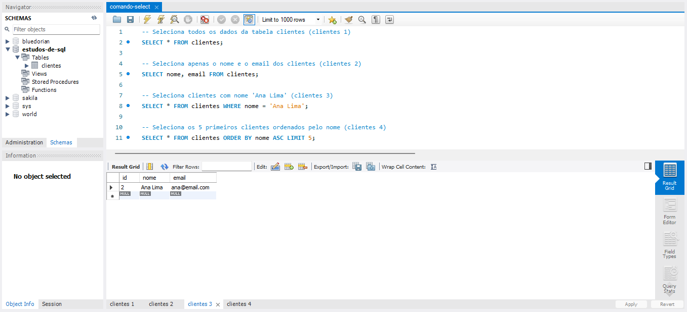
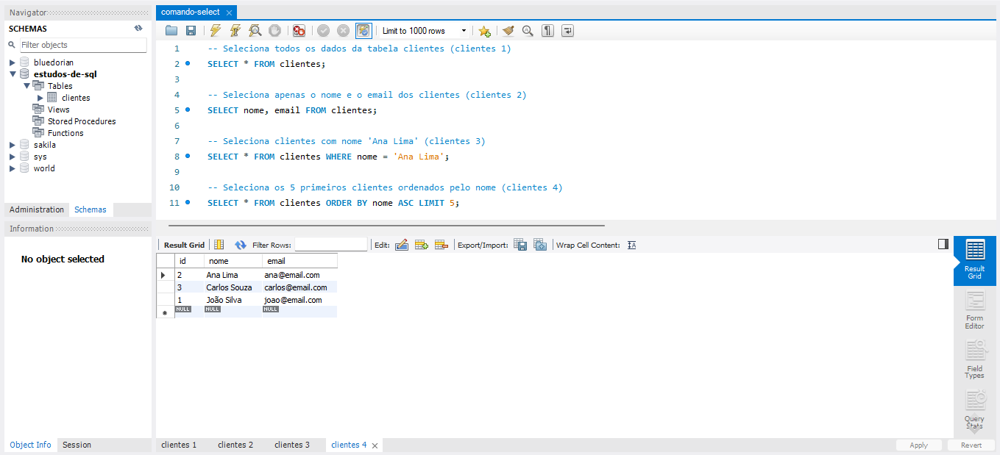

# Comando SELECT

O comando SELECT é utilizado para buscar dados em uma ou mais tabelas do banco de dados. Com ele, é possível visualizar todos os registros ou apenas campos específicos, além de aplicar condições e ordenar os resultados.

## Exemplos

```sql
-- Seleciona todos os campos e registros da tabela clientes
SELECT * FROM clientes;

-- Seleciona apenas as colunas nome e email da tabela clientes
SELECT nome, email FROM clientes;
```

Com o SELECT, você pode montar consultas simples ou avançadas, combinando filtros, ordenações e limites.

### Selecionando Todas as Colunas de uma Tabela


No SQL, o caractere "*" significa **TODOS**. Ele é muito utilizado quando desejamos selecionar ou referenciar todas as colunas de uma tabela (Nesse caso, as colunas: ```id```, ```nome``` e ```email```).

---

### Selecionando Colunas Específicas de uma Tabela


Já neste caso, ao invés de selecionar todas as colunas (Utilizando o "*") deixamos expresso de forma específica as colunas que desejaríamos que fossem selecionadas. Isso pode ser feito simplesmente colocando o nome das colunas após o comando **SELECT**.

---

### Selecionando e Filtrando Colunas e Linhas de uma Tabela


Neste caso, utilizamos o comando **WHERE** que serve como um filtro. Ele Limita as Linhas desde que atenda os parâmetros definos logo à frente do mesmo (Nesse caso: Na coluna ```nome``` o valor inserido ser igual a ```Ana Lima```).

---

### Selecionando, Ordenando e Limitando Linhas de uma Tabela


Neste último caso, fazemos a ordenação das linhas através dos valores de alguma coluna, nesce caso a coluna ```nome``` utilizando o comando **ORDER BY** e indicando a coluna. Através do comando **LIMIT** indicamos quantas linhas aparecerão através (ou não) dos filtros. Isso é feito colocando o número de linhas desejadas na frente do comando. Além disso o comando **ASC** indica que esse limite será aplicado na ordem ascendente. (Como as informações da coluna são textos, ele ordena na ordem alfabética, também ascendente)

---

## Fontes e Referências
- Documentação MySQL: https://dev.mysql.com/doc/refman/8.0/en/select.html