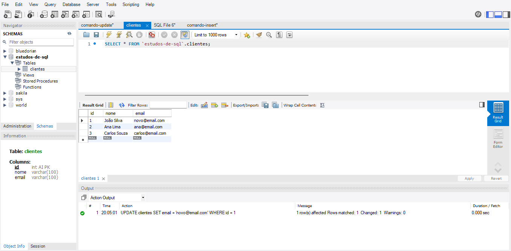
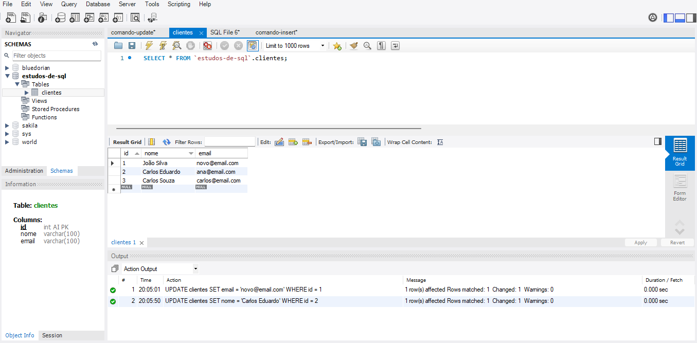

# Comando UPDATE

O comando UPDATE é utilizado para alterar dados já existentes em uma tabela do banco de dados. É importante sempre utilizar a cláusula WHERE para evitar modificar todos os registros da tabela por engano.

## Exemplos

```sql
-- Atualiza o e-mail do cliente com id 1
UPDATE clientes SET email = 'novo@email.com' WHERE id = 1;

-- Atualiza o nome do cliente com id 2
UPDATE clientes SET nome = 'Carlos Eduardo' WHERE id = 2;
```

Sempre confira o filtro do WHERE antes de executar um UPDATE para evitar alterações indesejadas.

## Atualizando EMAIL pelo Valor do ID


## Atualizando NOME pelo Valor do ID


## Atualizando Todos os Valores da Coluna **[Não Recomendado!]**

