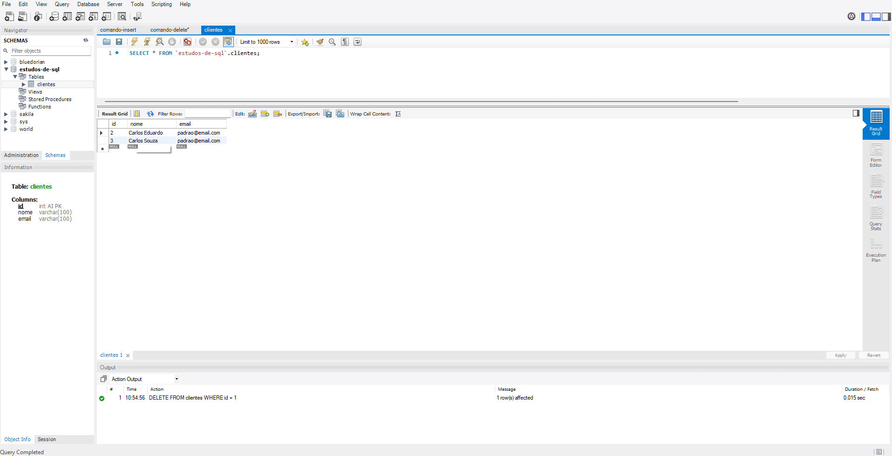
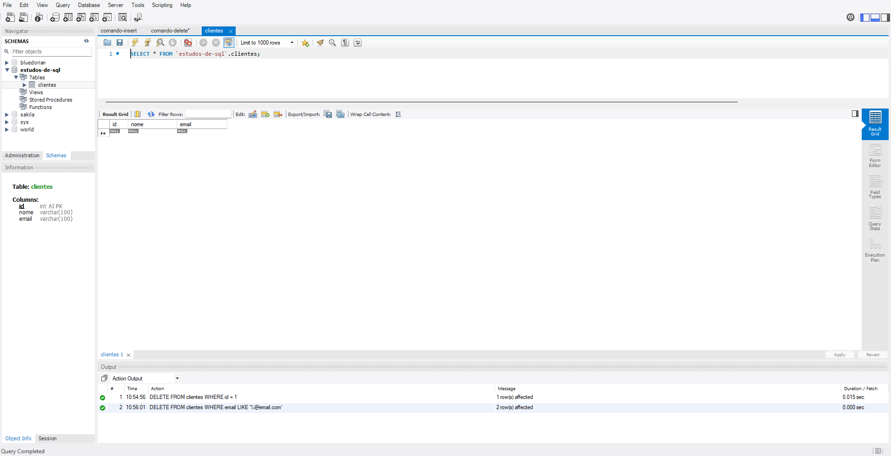
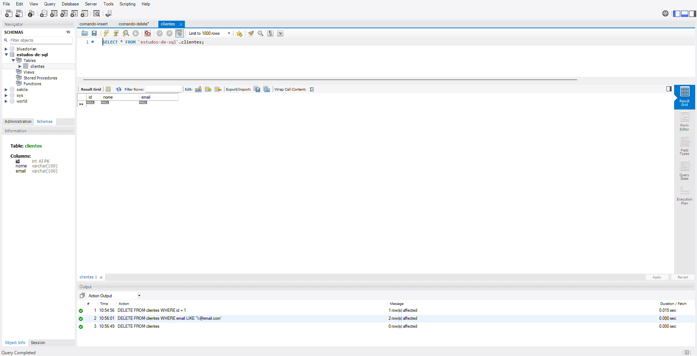

# Comando DELETE

O comando DELETE é utilizado para remover registros de uma tabela no banco de dados. É fundamental sempre utilizar a cláusula WHERE para evitar apagar todos os dados da tabela por engano.

## Exemplos

```sql
-- Remove o cliente com id 1
DELETE FROM clientes WHERE id = 1;

-- Remove todos os clientes com email do domínio 'teste.com'
DELETE FROM clientes WHERE email LIKE '%@teste.com';
```

Atenção: Sem a cláusula WHERE, todos os registros da tabela serão excluídos.

## Deletando linha pelo ID (Primeiro Exemplo)


## Deletando linha pelo Valor de Uma Coluna [Possui o Domínio: "@email.com"] (Segundo Exemplo)


## Deletando TODAS as Linhas da Tabela (Terceiro Exemplo)

