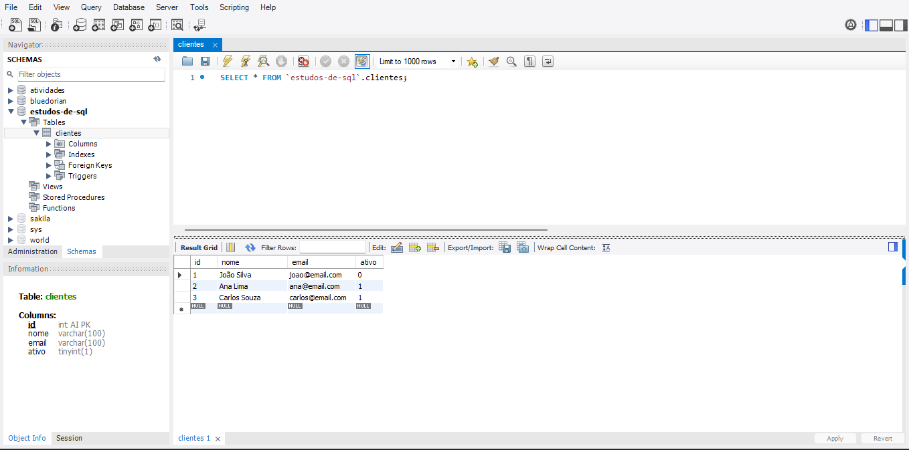
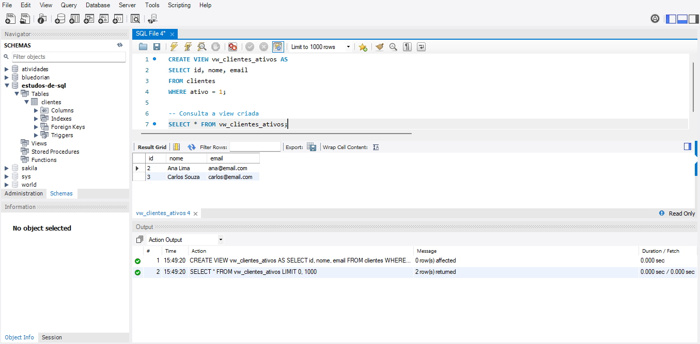

# Capítulo 06 - Views

O comando **VIEW** é utilizado para criar "tabelas virtuais" no banco de dados, facilitando a consulta, organização e segurança dos dados. Uma view apresenta os resultados de uma consulta SQL como se fossem uma tabela real, mas sem armazenar os dados fisicamente.

## Exemplos

```sql
-- Cria uma view que mostra apenas clientes ativos
CREATE VIEW vw_clientes_ativos AS
SELECT id, nome, email
FROM clientes
WHERE ativo = 1;

-- Consulta a view criada
SELECT * FROM vw_clientes_ativos;
```

Atenção: Views não armazenam dados, apenas a consulta. Alterações nas tabelas originais afetam automaticamente o resultado das views.

## Tabela Usada


## Consultando uma View (Primeiro Exemplo)


## Atualizando ou Excluindo uma View (Terceiro Exemplo)
```sql
-- Atualizando uma view existente
CREATE OR REPLACE VIEW vw_clientes_ativos AS
SELECT id, nome
FROM clientes
WHERE ativo = 1;

-- Excluindo uma view
DROP VIEW vw_clientes_ativos;
```

---

Os principais tópicos abordados serão:
- O que são views e para que servem
- Como criar e consultar views
- Exemplos práticos de uso
- Benefícios e limitações das views